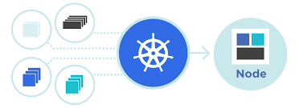

<div id="top"></div>


[![Contributors][contributors-shield]][contributors-url]
[![Forks][forks-shield]][forks-url]
[![Stargazers][stars-shield]][stars-url]
[![Issues][issues-shield]][issues-url]
[![MIT License][license-shield]][license-url]
[![LinkedIn][linkedin-shield]][linkedin-url]


<br />
<div align="center">
  <a href="https://github.com/praparn/github-action-x-any-xks">
    
  </a>

<h3 align="left">GitHub Action for Any XKS</h3>
  <p align="left">
     This repository is backgroud to leverage feature of github action and terraform technology for manage in lifecycle of Kubernetes on cloud platform and minimize effort to all contributed for operate Kubernetes cluster (Any XKS). And will continute update
   </p>
</div>

### Remark

* All credential in this project was designed to store on "secrets" on github. If you new with this. Please kindly following [GitHub Secrets](https://github.com/Azure/actions-workflow-samples/blob/master/assets/create-secrets-for-GitHub-workflows.md)
* As project are coverage multiple cloud provider. So when you fork/clone this repository in action. You can consider to remove unused cloud provider's folder
* In case to create multiple cluster with same cloud provider. Please create new branch for operate.


### Built With

* [Azure Cli](https://docs.microsoft.com/en-us/cli/azure/)
* [AWS Cli](https://aws.amazon.com/th/cli/)
* [Gcloud Cli](https://cloud.google.com/sdk/gcloud)
* [Terraform](https://www.terraform.io/)
* [GitHub Action](https://github.com/features/actions)

<p align="right">(<a href="#top">back to top</a>)</p>

<!-- GETTING STARTED -->
## Azure AKS Cluster

Cloud provider's folder: aws-eks

### Prerequisites

Before start to create AKS cluster. Please input credential for operate on Azure Portal on github's "secrets" as detail below:
* {AZURE_CREDENTIALS}: Store output in JSON format of your service principle. If you not yet to create service principle. Please follow this KB [Azure Service Principle](https://docs.microsoft.com/en-us/azure/developer/github/connect-from-azure?tabs=azure-cli%2Clinux#use-the-azure-login-action-with-a-service-principal-secret)
  ```sh
  {
    "clientId": "<GUID>",
    "clientSecret": "<GUID>",
    "subscriptionId": "<GUID>",
    "tenantId": "<GUID>",
    (...)
  }
  ```
* {AZURE_REGION}: Input your region on portal. Ex:"eastasia" [Region code](https://azuretracks.com/2021/04/current-azure-region-names-reference/)
  ```sh
  "Region Name"
  ```
* {AZURE_RESOURCEGROUP}: Input your resource group name for create other elements
  ```sh
  "Resource Group Name"
  ```
* {AZURE_STORAGEACCOUNT}: Input your storage account name for keep terraform state on portal. Remark: Storage account name must be between 3 and 24 characters in length and use numbers and lower-case letters only
  ```sh
  "Storage Account Name"
  ```

### Installation

1. Get a free API Key at [https://example.com](https://example.com)
2. Clone the repo
   ```sh
   git clone https://github.com/github_username/repo_name.git
   ```
3. Install NPM packages
   ```sh
   npm install
   ```
4. Enter your API in `config.js`
   ```js
   const API_KEY = 'ENTER YOUR API';
   ```

<p align="right">(<a href="#top">back to top</a>)</p>

<!-- LICENSE -->
## License

Distributed under the Apacher License. See `LICENSE.txt` for more information.

<p align="right">(<a href="#top">back to top</a>)</p>


<!-- CONTACT -->
## Contact

Praparn Lueangphoonlap - [@facebook](https://www.facebook.com/praparn.lungpoonlap) - praparn@gmail.com

Project Link: [https://github.com/praparn/github-action-x-any-xks](https://github.com/praparn/github-action-x-any-xks)

<p align="right">(<a href="#top">back to top</a>)</p>


<!-- ACKNOWLEDGMENTS -->
## Acknowledgments

* []()
* []()
* []()

<p align="right">(<a href="#top">back to top</a>)</p>


<!-- MARKDOWN LINKS & IMAGES -->
<!-- https://www.markdownguide.org/basic-syntax/#reference-style-links -->
[contributors-shield]: https://img.shields.io/github/contributors/github_username/repo_name.svg?style=for-the-badge
[contributors-url]: https://github.com/github_username/repo_name/graphs/contributors
[forks-shield]: https://img.shields.io/github/forks/github_username/repo_name.svg?style=for-the-badge
[forks-url]: https://github.com/github_username/repo_name/network/members
[stars-shield]: https://img.shields.io/github/stars/github_username/repo_name.svg?style=for-the-badge
[stars-url]: https://github.com/github_username/repo_name/stargazers
[issues-shield]: https://img.shields.io/github/issues/github_username/repo_name.svg?style=for-the-badge
[issues-url]: https://github.com/github_username/repo_name/issues
[license-shield]: https://img.shields.io/github/license/github_username/repo_name.svg?style=for-the-badge
[license-url]: https://github.com/github_username/repo_name/blob/master/LICENSE.txt
[linkedin-shield]: https://img.shields.io/badge/-LinkedIn-black.svg?style=for-the-badge&logo=linkedin&colorB=555
[linkedin-url]: https://linkedin.com/in/linkedin_username
[product-screenshot]: images/screenshot.png
